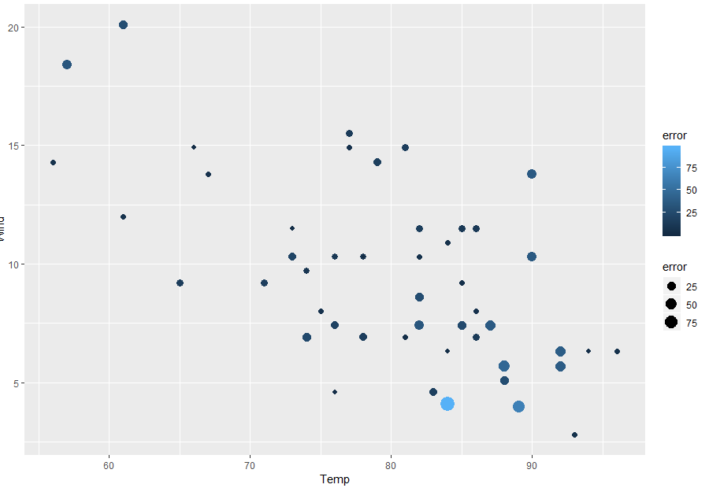

---

# Instructions
Conduct **predictive analytics** on the Air Quality dataset to predict changes in
`ozone` values.You will split the Air Quality dataset into a "**training set**" and
a "**test set**". Use various techniques, such as **Kernal-Based Support Vector Machines** (KSVM), **Support Vector Machines** (SVM), **Linear Modelling** (LM), 
and **Naive Bayes** (NB). Determine which technique is best for the dataset.

Add all of your libraries that you use for this homework here.
```{r setup, warning=F, message=F}
# Add your library below.

library(tidyverse)
library(e1071)
library(kernlab)
library(Metrics)
library(gridExtra)
library(caTools)
library(reshape2)
library(shiny)

```

# Step 1: Load the data (0.5 point)

Let's go back and analyze the air quality dataset (we used that dataset previously 
in the visualization lab). Remember to think about how to deal with the NAs in the data. 
Replace NAs with the mean value of the column.

```{r, "Step 1"}
# Write your code below.

data <- airquality

#str(data)
data$Ozone[is.na(data$Ozone)] <- mean(data$Ozone, na.rm = TRUE)
data$Solar.R[is.na(data$Solar.R)] <- mean(data$Solar.R, na.rm=TRUE)
data$Wind[is.na(data$Wind)] <- mean(data$Wind, na.rm=TRUE)
data$Temp[is.na(data$Wind)] <- mean(data$Wind, na.rm=TRUE)

```

---

# Step 2: Create train and test data sets (0.5 point)

Using techniques discussed in class (or in the video), create two datasets – 
one for training and one for testing.

```{r, "Step 2"}
# Write your code below.

set.seed(123)
split <- sample.split(data$Ozone, SplitRatio = 0.75)

train <- subset(data, split == TRUE)
test <- subset(data, split == FALSE)


```

---

# Step 3: Build a model using KSVM and visualize the results (2 points)

## Step 3.1 - Build a model
Using `ksvm()`, create a model to try to predict changes in the `ozone` values. 
You can use all the possible attributes, or select the attributes that you think 
would be the most helpful. Of course, use the training dataset.

```{r, "Step 3.1"}
# Write your code below.
#plot(data)

mod1 <- ksvm(Ozone ~., data = train)
mod1


#mod2 <- ksvm(Ozone ~ Solar.R, data=training_set)
#mod3 <- ksvm(Ozone ~ Wind, data=training_set)
#mod4 <- ksvm(Ozone ~ Temp, data=training_set)
#mod5 <- ksvm(Ozone ~ Month, data=training_set)
#mod6 <- ksvm(Ozone ~ Day, data=training_set)


predictor <- predict(mod1, test)

predictDF <- data.frame(predictor, test$Ozone)

names(predictDF)[2] <- "answer"


predictDF$id <- 1:(nrow(predictDF))

head(predictDF)
```

## Step 3.2 - Test the model and find the RMSE
Test the model using the test dataset and find the **Root Mean Squared Error** (RMSE).
Root Mean Squared Error formula here:  
* http://statweb.stanford.edu/~susan/courses/s60/split/node60.html 

```{r, "Step 3.2"}
# Write your code below.

rmse(predictDF$answer,predictDF$predictor)

```

## Step 3.3 - Plot the results. 
Use a scatter plot. Have the x-axis represent `Temp`, the y-axis represent `Wind`, 
the point size and color represent the error (as defined by the actual ozone level 
minus the predicted ozone level). It should look similar to this:




```{r, "Step 3.3"}
# Write your code below.

newDF <- data.frame(test$Temp, test$Wind)
newDF$error <- test$Ozone - predictDF$predictor

graph1 <- ggplot(newDF, aes( x= test.Temp, y= test.Wind, size = error, color = error))+
  geom_point()
graph1
```

## Step 3.4 - Compute models and plot the results for `svm()` and `lm()`
Use `svm()` from in the `e1071` package and `lm()` from Base R to computer two 
new predictive models. Generate similar charts for each model.

### Step 3.4.1 - Compute model for `svm()`
```{r, "Step 3.4.1"}
# Write your code below.

tuned <- tune(svm, Ozone ~., data = train, kernal = "linear", ranges = list(cost = c(.001,.01,.1,1,10,100)))

tuned$best.model
#best model

SVMmod <- svm(Ozone~., data = train, cost = 1, kernal = "linear")
summary(SVMmod)


SVMvalues <- predict(SVMmod, test)

svmDF <- data.frame(test$Temp, test$Wind)
svmDF$error <- test$Ozone - SVMvalues

graph2 <- ggplot(svmDF, aes( x= test.Temp, y= test.Wind, size =error, color = error)) + geom_point()
graph2
```

### Step 3.4.2 - Compute model for `lm()`
```{r, "Step 3.4.2"}
# Write your code below.

lmMod <- lm(Ozone~., data = train)

lmValues <- predict(lmMod, test)

lmDF <- data.frame(test$Temp, test$Wind)
lmDF$error <- test$Ozone - lmValues 

graph3 <- ggplot(lmDF, aes(x=test.Temp, y= test.Wind, size = error, color = error))+geom_point()
graph3
```

## Step 3.5 - Plot all three model results together
Show the results for the KSVM, SVM, and LM models in one window. Use the `grid.arrange()`
function to do this. All three models should be scatterplots. 

```{r, "Step 3.5"}
# Write your code below.

grid.arrange(graph1,graph2,graph3)

```

---

# Step 4: Create a “goodOzone” variable (1 point)

This variable should be either 0 or 1. It should be 0 if the ozone is below the 
average for all the data observations, and 1 if it is equal to or above the 
average ozone observed.

```{r, "Step 4"}
# Write your code below.

newData <- data
newData$goodOzone <- as.factor(ifelse(newData$Ozone > mean(newData$Ozone), newData$goodOzone <-1, newData$goodOzone <-0))


newSplit <- sample.split(newData$goodOzone, SplitRatio = 0.75)
newTrain <- subset(newData, newSplit ==TRUE)
newTest <- subset(newData, newSplit==FALSE)


```

---

# Step 5: Predict "good" and "bad" ozone days. (3 points)
Let's see if we can do a better job predicting “good” and “bad” days.

## Step 5.1 - Build a model 
Using `ksvm()`, create a model to try to predict `goodOzone`. 
You can use all the possible attributes, or select the attributes that you think 
would be the most helpful. Of course, use the training dataset.
```{r, "Step 5.1"}
# Write your code below.

ksvmMod <- ksvm(goodOzone~., data = newTrain)


```

## Step 5.2 - Test the model and find the percent of `goodOzone`
Test the model on the test dataset, and compute the percent of “goodOzone” that
was correctly predicted.
```{r, "Step 5.2"}
# Write your code below.
ksvmPredictor <- predict(ksvmMod, newTest)
ksvmDF <- data.frame(newTest, ksvmPredictor)

head(ksvmDF)

correctTF <- ifelse(ksvmDF$goodOzone == ksvmDF$ksvmPredictor, TRUE, FALSE)
correctCount <- sum(correctTF == TRUE)
correctCount/nrow(ksvmDF)
```

## Step 5.3 - Plot the results
```
# determine the prediction is "correct" or "wrong" for each case,   

# create a new dataframe contains correct, tempreture and wind, and goodZone

# change column names
  colnames(Plot_ksvm) <- c("correct","Temp","Wind","goodOzone","Predict")
# plot result using ggplot
```
Use a scatter plot. Have the x-axis represent `Temp`, the y-axis represent 
`Wind`, the shape representing what was predicted (good or bad day), the color 
representing the actual value of `goodOzone` (i.e. if the actual ozone level was
good) and the size represent if the prediction was correct (larger symbols should 
be the observations the model got wrong). The plot should look similar to this:


 ```{r, "Step 5.3"}
# Write your code below.
correct<- ifelse(correctTF ==TRUE, print("correct"), print("wrong"))

DF1 <- data.frame(correct, newTest$Temp, newTest$Wind, newTest$goodOzone, ksvmDF$ksvmPredictor)
colnames(DF1) <- c("correct","Temp","Wind", "goodOzone", "Predict")

graph4 <- ggplot(DF1, aes(x=Temp, y=Wind, shape = Predict, color = goodOzone, size = correct))+geom_point()

graph4
```

## Step 5.4 - Compute models and plot the results for `svm()` and `lm()`
Use `svm()` from in the e1071 package and `lm()` from Base R to computer two 
new predictive models. Generate similar charts for each model.

### Step 5.4.1 - Compute model for `svm()`
```{r, "Step 5.4.1"}
# Write your code below.

newSVM <- svm(goodOzone ~., data = newTrain)

newSVMpred <- predict(newSVM, newTest)

newSVMdf <- data.frame(newTest, newSVMpred)

svmCorrectTF <- ifelse(newSVMdf$goodOzone==newSVMdf$newSVMpred, TRUE, FALSE)

svmCorrectCount <- sum(svmCorrectTF ==TRUE)
svmCorrectCount/nrow(newSVMdf)

svmCorrect<- ifelse(svmCorrectTF==TRUE, print("correct"),print("wrong"))


svmDF2 <- data.frame(svmCorrect, newTest$Temp, newTest$Wind, newTest$goodOzone, newSVMdf$newSVMpred)
colnames(svmDF2) <- c("correct","Temp","Wind","goodOzone","Predict")


graph5<- ggplot(svmDF2, aes(x=Temp, y= Wind, shape = Predict, color = goodOzone, size = correct)) + geom_point()

graph5
```

### Step 5.4.2 - Compute model for `naiveBayes()`
```{r, "Step 5.4.2"}
# Write your code below.

NBmod <- naiveBayes(goodOzone~., data = newTrain)

NBpred <- predict(NBmod, newTest)

NBdf <- data.frame(newTest, NBpred)

NBcorrectTF <- ifelse(NBdf$goodOzone == NBdf$NBpred, TRUE, FALSE)

NBcorrectCount <- sum(NBcorrectTF ==TRUE)

NBcorrectCount/nrow(NBdf)

NBcorrect <- ifelse(NBcorrectTF ==TRUE, print("correct"), print("wrong"))

NBdf2 <- data.frame(NBcorrect, newTest$Temp, newTest$Wind, newTest$goodOzone, NBdf$NBpred)

colnames(NBdf2) <- c("correct","Temp","Wind","goodOzone","Predict")

graph6 <- ggplot(NBdf2,aes(x=Temp, y=Wind, shape = Predict, color = goodOzone, size = correct))+geom_point()
graph6
```

## Step 5.5 - Plot all three model results together
Show the results for the KSVM, SVM, and LM models in one window. Use the `grid.arrange()`
function to do this. All three models should be scatterplots. 

```{r, "Step 5.5"}
# Write your code below.


grid.arrange(graph4,graph5,graph6)

```


---

# Step 6: Which are the best Models for this data? (2 points)

Review what you have done and state which is the best and why.

> Based off the 3 graphs, they look similar and appear to show similar points. The naiveBayes model had a higher correct prediction rate than the SVM and KSVM models. It came at 92.1% correct predictions, so I would choose this model as the best model for this data. If I were to make a decision soley based on the graphs, then I would also choose the NB model because it has less "big points" which is a good thing.

>

